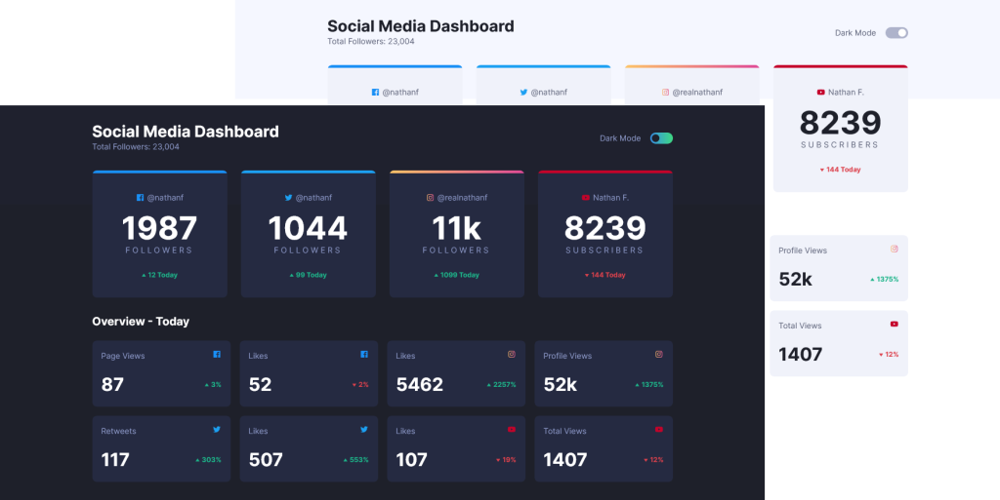

# Frontend Mentor - Social media dashboard with theme switcher solution

This is a solution to the [Social media dashboard with theme switcher challenge on Frontend Mentor](https://www.frontendmentor.io/challenges/social-media-dashboard-with-theme-switcher-6oY8ozp_H). Frontend Mentor challenges help you improve your coding skills by building realistic projects. 

## Table of contents

- [Overview](#overview)
  - [The challenge](#the-challenge)
  - [Screenshot](#screenshot)
  - [Links](#links)
- [My process](#my-process)
  - [Built with](#built-with)
  - [What I learned](#what-i-learned)
  - [Continued development](#continued-development)
  - [Useful resources](#useful-resources)
- [Author](#author)
- [Acknowledgments](#acknowledgments)

## Overview

### The challenge

Users should be able to:

- View the optimal layout for the site depending on their device's screen size
- See hover states for all interactive elements on the page
- Toggle color theme to their preference

### Screenshot
This is my solution

### Links

- Solution URL: [Source code](https://github.com/itsmusa/social-media-dashboard)
- Live Site URL: [Add live site URL here](https://your-live-site-url.com)

## My process

### Built with

- Semantic HTML5 markup
- CSS custom properties
- SASS/SCSS
- Flexbox
- CSS Grid
- Mobile-first workflow

### What I learned

Thanks to inspiration from various blogs, I learned how I could change the theme of the page, and it turned out to be simpler than I thought.

For the user to save their theme, I learned about using localStorage property.

### Continued development

in future developments, the app should be able to pick the default theme from the users system settings.

### Useful resources

- [MDN Docs](https://developer.mozilla.org/en-US/)

## Author

- Website - [Musa Magwaza](https://www.github.com/itsmusa)
- Frontend Mentor - [@itsmusa](https://www.frontendmentor.io/profile/itsmusa)
- Twitter - [@flawedgoat](https://www.twitter.com/flowedgoat)

## Acknowledgments
